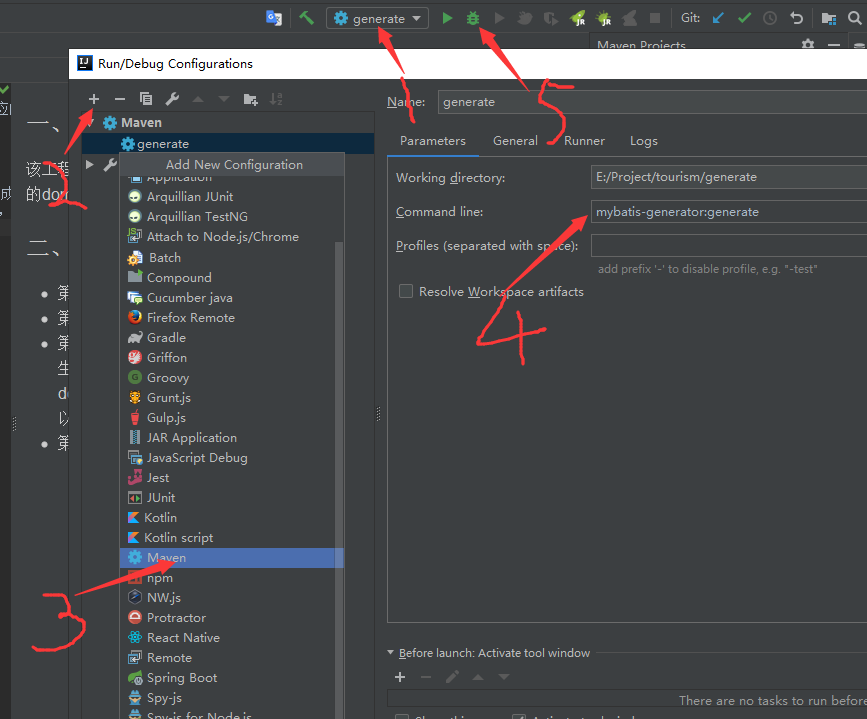

### 一、功能描述
该工程主要作为一个工具工程使用，目的是通过mybatis generate自动生成对应的domain、mapper、xml，简化工作量

### 二、使用方法
* 第一步：配置数据源
* 第二步：通过 targetPackage 配置实际项目需要生成的路径
* 第三步：通过 table 标签设置数据，如果tableName="%"，表示对所有表生成，否则指定表名。
在批量生成的时候，可以使用domainObjectRenamingRule 设置转换过滤方式，比如表名是 tb_test，可以把前缀tb过滤掉，生成对象Test。
* 第四步： 运行。步骤如下,启动对应的参数:   mybatis-generator:generate

